# Complete Database Audit & Relationship Diagram

## Fixes Applied

| # | Fix | Impact |
|---|-----|--------|
| 1 | Bayanat_Activity dates verified | 342K rows — 2015-2019 are MOHRE reporting periods, acceptable |
| 2 | Large supply_count verified | Up to 92K — plausible for Dubai private sector (3M+ workers) |
| 3 | Orphan demand FK deleted | 1 row with invalid occupation_id removed |
| 4 | dim_course program_name enriched | From 8% to 38% filled via course_code prefix mapping |
| 5 | All 7 materialized views refreshed | vw_gap_cube: 2,672 rows, vw_skill_gap: 13,084 rows |
| 6 | MOHRE permits separated | 252 rows moved from demand to fact_work_permits |
| 7 | GLMM aggregates separated | 315 rows moved from supply to fact_workforce_totals |
| 8 | Unemployment data loaded | 510 rows from 9 Bayanat CSVs |
| 9 | dim_time trimmed | 7,670 → 4,748 rows (removed 2028-2035 future dates) |

---

## Entity Relationship Diagram

```mermaid
erDiagram
    dim_time {
        int time_id PK
        date date
        int week
        int month
        int quarter
        int year
        varchar month_label
    }

    dim_region {
        varchar region_code PK
        varchar emirate
        varchar emirate_ar
        varchar city
    }

    dim_occupation {
        int occupation_id PK
        varchar code_isco
        text code_esco
        varchar code_soc
        varchar title_en
        varchar title_ar
        varchar isco_major_group
    }

    dim_skill {
        int skill_id PK
        varchar label_en
        varchar label_ar
        varchar skill_type
        varchar taxonomy
        varchar uri_esco
    }

    dim_sector {
        int sector_id PK
        varchar label_en
        varchar label_ar
        varchar code_isic
    }

    dim_institution {
        int institution_id PK
        varchar name_en
        varchar name_ar
        varchar emirate
        varchar institution_type
        varchar website
    }

    dim_discipline {
        int discipline_id PK
        varchar label_en
        varchar label_ar
        varchar isced_code
    }

    dim_program {
        int program_id PK
        varchar program_name
        varchar degree_level
        int institution_id FK
        int discipline_id FK
        varchar source
    }

    dim_course {
        int course_id PK
        varchar course_code
        varchar course_name
        int credit_hours
        text description
        varchar program_name
        int institution_id FK
        varchar source
    }

    dim_onet_occupation {
        int id PK
        varchar soc_code
        varchar title
        text description
        int occupation_id FK
    }

    fact_supply_talent_agg {
        int id PK
        int time_id FK
        varchar region_code FK
        int occupation_id FK
        int sector_id FK
        varchar gender
        varchar age_group
        int supply_count "EMPLOYED headcount"
        varchar source
    }

    fact_demand_vacancies_agg {
        int id PK
        int time_id FK
        varchar region_code FK
        int occupation_id FK
        int sector_id FK
        varchar experience_band
        int demand_count "always 1 per posting"
        varchar source
    }

    fact_unemployed {
        int id PK
        int year
        varchar region_code
        varchar gender
        varchar age_group
        varchar nationality
        varchar education_level
        float unemployment_rate
        int unemployed_count
        varchar source
    }

    fact_occupation_skills {
        int id PK
        int occupation_id FK
        int skill_id FK
        varchar relation_type "essential or optional"
    }

    fact_job_skills {
        int id PK
        int demand_id FK
        int skill_id FK
        varchar relation_type
        varchar source "esco_inherited"
    }

    fact_course_skills {
        int id PK
        varchar course_id FK
        int skill_id FK
        float weight
        float confidence
    }

    fact_ai_exposure_occupation {
        int id PK
        int occupation_id FK
        float exposure_z
        float exposure_0_100
        float automation_probability
        float llm_exposure
        varchar source
    }

    fact_supply_graduates {
        int id PK
        int institution_id FK
        int discipline_id FK
        varchar region_code FK
        int graduates_count
        varchar source
    }

    fact_program_enrollment {
        int id PK
        int institution_id FK
        int program_id FK
        varchar region_code FK
        int enrollment_count
        bool is_estimated
        varchar source
    }

    fact_work_permits {
        int id PK
        varchar region_code
        int permit_count
        varchar source "MOHRE - NOT vacancies"
    }

    fact_workforce_totals {
        int id PK
        varchar region_code
        int workforce_total
        varchar source "GLMM/MOHRE aggregate"
    }

    fact_salary_benchmark {
        int id PK
        varchar region_code FK
        float min_salary
        float median_salary
        float max_salary
    }

    dim_time ||--o{ fact_supply_talent_agg : "time_id"
    dim_time ||--o{ fact_demand_vacancies_agg : "time_id"
    dim_region ||--o{ fact_supply_talent_agg : "region_code"
    dim_region ||--o{ fact_demand_vacancies_agg : "region_code"
    dim_region ||--o{ fact_supply_graduates : "region_code"
    dim_region ||--o{ fact_program_enrollment : "region_code"
    dim_region ||--o{ fact_salary_benchmark : "region_code"
    dim_occupation ||--o{ fact_supply_talent_agg : "occupation_id"
    dim_occupation ||--o{ fact_demand_vacancies_agg : "occupation_id"
    dim_occupation ||--o{ fact_occupation_skills : "occupation_id"
    dim_occupation ||--o{ fact_ai_exposure_occupation : "occupation_id"
    dim_occupation ||--o{ dim_onet_occupation : "occupation_id"
    dim_skill ||--o{ fact_occupation_skills : "skill_id"
    dim_skill ||--o{ fact_job_skills : "skill_id"
    dim_skill ||--o{ fact_course_skills : "skill_id"
    dim_sector ||--o{ fact_supply_talent_agg : "sector_id"
    dim_sector ||--o{ fact_demand_vacancies_agg : "sector_id"
    dim_institution ||--o{ dim_program : "institution_id"
    dim_institution ||--o{ dim_course : "institution_id"
    dim_institution ||--o{ fact_supply_graduates : "institution_id"
    dim_institution ||--o{ fact_program_enrollment : "institution_id"
    dim_discipline ||--o{ dim_program : "discipline_id"
    dim_discipline ||--o{ fact_supply_graduates : "discipline_id"
    dim_program ||--o{ fact_program_enrollment : "program_id"
    fact_demand_vacancies_agg ||--o{ fact_job_skills : "demand_id"
    dim_course ||--o{ fact_course_skills : "course_id"
```



---

## Table Catalog — Sample Data + Meta Description

### DIMENSION TABLES (reference data)

**dim_time** — 4,748 rows | Calendar dates 2015-2027
```
time_id | date       | week | month | quarter | year | month_label
31      | 2015-01-31 | 5    | 1     | 1       | 2015 | 2015-01
396     | 2016-01-31 | 5    | 1     | 1       | 2016 | 2016-01
```
*Supply references 2015-2019. Demand references 2024-2026. No overlap.*

**dim_region** — 7 rows | UAE emirates
```
region_code | emirate        | emirate_ar
AUH         | Abu Dhabi      | أبو ظبي
DXB         | Dubai          | دبي
SHJ         | Sharjah        | الشارقة
```
*Complete — all 7 emirates.*

**dim_occupation** — 3,897 rows | ESCO occupations with ISCO codes
```
occupation_id | code_isco | title_en              | title_ar              | isco_major_group
26341         | 2654.1.7  | technical director    | المدير الفني          | 2
26500         | 2512.1    | software developer    | مطور برمجيات          | 2
```
*Source: ESCO v1.2 (3,039) + AI-mapped additions (858). Bilingual EN/AR.*

**dim_skill** — 21,574 rows | ESCO + O*NET skills
```
skill_id | label_en                    | skill_type       | taxonomy
117513   | mathematics                 | knowledge        | ESCO
118200   | Critical Thinking           | skill            | O*NET
```
*Source: ESCO v1.2 (13,960) + O*NET v29.1 (7,614).*

**dim_institution** — 168 rows | UAE universities
```
institution_id | name_en                    | emirate   | institution_type
1059           | Abu Dhabi Polytechnic      | Abu Dhabi | Federal
1080           | Khalifa University         | Abu Dhabi | Federal
```
*Source: CAA accreditation list + Bayanat HEI data.*

**dim_course** — 19,196 rows | University courses from 100+ catalogs
```
course_id | course_code | course_name             | credit_hours | institution_name      | program_name
1         | MATH1001    | Precalculus             | 3            | Abu Dhabi Polytechnic | Mathematics/Statistics
500       | CS201       | Data Structures         | 3            | Khalifa University    | Computer Science/IT
```
*Source: 70 university catalog PDFs parsed → CSV. 38% have program_name.*

**dim_program** — 3,902 rows | Degree programs
```
program_id | program_name                 | degree_level | institution_id | source
1          | Bachelor of Science in CS    | Bachelor     | 1080           | caa_accredited
3500       | MBA                          | Master       | 1059           | university_catalog
```
*Source: CAA (2,423) + web scrape (1,010) + catalog PDFs (469).*

---

### FACT TABLES — Supply Side

**fact_supply_talent_agg** — 842,216 rows | **EMPLOYED worker headcounts** (NOT available talent)
```
id      | time_id | region_code | occupation_id | sector_id | gender | age_group | supply_count | source
1010079 | 396     | AUH         | 27320         | NULL      | Female | 30-34     | 9            | Bayanat_MOHRE
1400662 | 31      | AJM         | NULL          | 16        | Female | 20-24     | 7            | Bayanat_Activity
```
*Supply_count = number of EMPLOYED workers. NOT unemployed/available. Years: 2015-2019.*
*Source: Bayanat_MOHRE (500K rows) + Bayanat_Activity (342K rows).*
*Empty: education_level (0%), nationality (0%), experience_band (0%), wage_band (0%).*

**fact_unemployed** — 510 rows | Unemployment rates from Bayanat surveys
```
id  | year | region_code | gender | age_group | nationality | unemployment_rate | source
1   | 2016 | NULL        | Female | 15-19     | NULL        | 15.4              | Bayanat_unemployment_age_gender
100 | 2016 | NULL        | Female | 15-19     | Citizen     | 50.8              | Bayanat_unemployment_nat_age_gender
```
*Rates as percentages. Mostly 2016 data. Abu Dhabi has education breakdown. National data limited.*

**fact_supply_graduates** — 4,230 rows | Annual graduate output
```
id | institution_id | discipline_id | region_code | graduates_count | source
1  | 1080           | 5             | AUH         | 150             | Bayanat_Graduates
```
*Real Bayanat data. 2010-2024. By institution and discipline.*

**fact_program_enrollment** — 668 rows | Student enrollment
```
id | institution_id | program_id | region_code | enrollment_count | is_estimated | source
1  | NULL           | NULL       | AUH         | 228457           | false        | bayanat_emirate_sector
```
*Mix: 654 actual + 14 estimated. 2002-2024.*

---

### FACT TABLES — Demand Side

**fact_demand_vacancies_agg** — 37,127 rows | **Individual job postings** (1 row = 1 posting)
```
id     | time_id | region_code | occupation_id | sector_id | experience_band  | demand_count | source
240713 | 3554    | DXB         | 29292         | 45        | Mid-Senior level | 1            | LinkedIn
240900 | 3600    | AUH         | 28000         | NULL      | Entry level      | 1            | LinkedIn
```
*demand_count is ALWAYS 1. Each row = one LinkedIn/JSearch job posting. 2024-2026.*
*MOHRE work permits (252 rows) moved to separate fact_work_permits.*
*sector_id: 36% filled. experience_band: 99% filled.*

**fact_work_permits** — 252 rows | **MOHRE permits issued** (NOT vacancies)
```
id | region_code | permit_count | source
1  | DXB         | 148911       | MOHRE_permits
```
*These are work permits ISSUED — not job openings. Separated from demand for accuracy.*

**fact_workforce_totals** — 315 rows | **Total emirate workforce** (reference)
```
id | region_code | workforce_total | source
1  | DXB         | 643507          | MOHRE_2024
```
*Mega-aggregates. Separated from supply. Reference only.*

---

### FACT TABLES — Skills & AI

**fact_occupation_skills** — 321,806 rows | ESCO occupation→skill mappings
```
id | occupation_id | skill_id | relation_type
1  | 26341         | 117513   | essential
2  | 26341         | 118200   | optional
```
*Source: ESCO v1.2. 139,557 essential + 182,249 optional.*

**fact_job_skills** — 3,062,708 rows | Skills per job (GENERATED — inherited from ESCO)
```
id | demand_id | skill_id | relation_type | source
1  | 240713    | 117513   | essential     | esco_inherited
```
*NOT extracted from job descriptions. Each job inherits ALL skills from its ESCO occupation.*
*This inflates skill counts. Average ~86 skills per job.*

**fact_course_skills** — 24,799 rows | Skills per course (GENERATED — token matched)
```
id | course_id | skill_id | weight | confidence
1  | 1         | 117600   | 0.45   | 0.45
```
*Token-matching course names against ESCO skill labels. ~60-70% accuracy.*

**fact_ai_exposure_occupation** — 2,304 rows | AI automation risk scores
```
id | occupation_id | exposure_0_100 | automation_probability | source
1  | 27000         | 74.5           | 0.85                  | Anthropic_ObservedExposure
2  | 27000         | 95.0           | NULL                  | AIOE
```
*Source: Anthropic (756), AIOE (774), Frey-Osborne (774). Multiple scores per occupation.*

---

### MATERIALIZED VIEWS

**vw_gap_cube** — 2,672 rows | Supply vs Demand per occupation
```
region_code | occupation        | code_isco | supply_count | demand_count | gap_abs | total_skills
DXB         | software developer| 2512.1    | 5000         | 200          | -4800   | 55
```
*⚠️ Supply = employed headcount (2015-2019). Demand = job postings (2024-2025). Different time periods and scales.*

**vw_skill_gap** — 13,084 rows | Skill-level supply vs demand
```
skill_id | skill       | demand | supply_courses | gap
117513   | mathematics | 12091  | 0              | 12091
```
*Demand inflated by ESCO inheritance. Supply based on token matching.*

---

### KNOWN LIMITATIONS

| Issue | Impact | Can Be Fixed? |
|-------|--------|--------------|
| Supply (2015-2019) vs Demand (2024-2026) — no year overlap | Gap comparison crosses 5+ year time gap | Need 2024 Bayanat employment data |
| supply_count = employed, not available talent | "Supply" label misleading | Rename to "employed_count" |
| Job skills inherited from ESCO (avg 86 per job) | Skill demand counts inflated | Extract skills from JDs directly |
| Course-skill matching is token-based | ~60-70% accuracy, some false matches | Use LLM for better matching |
| Unemployment data limited to 2016 | Can't show current unemployment | Need fresh Bayanat survey data |
| 3 fact tables empty | fact_education_stats, fact_population_stats, fact_wage_hours | Load from existing CSVs |
